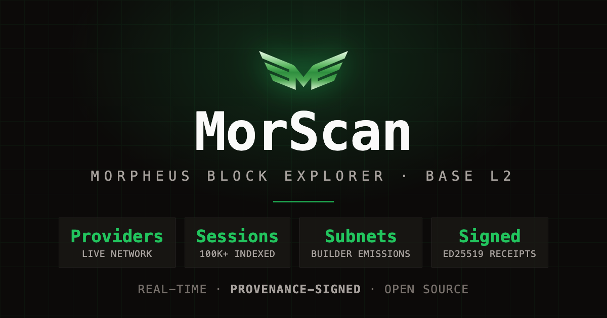
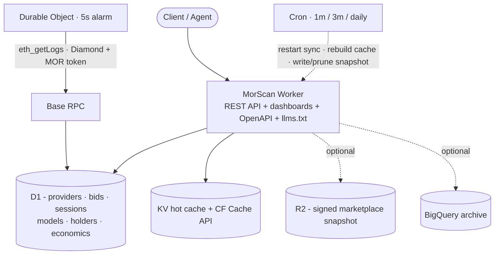

# MorScan

**The Fair Source block explorer for the Morpheus decentralized-AI network on Base L2.**

[](LICENSE)
[](https://developers.cloudflare.com/workers/)
[](https://www.typescriptlang.org/)
[](docs/architecture/provenance.md)
[](https://github.com/DRM3Labs-OSS/morscan.io/actions/workflows/ci.yml)

<p align="center">
  
</p>

**The story:** [Cashew is now MorScan - the launch announcement](https://drm3.io/blog/cashew-is-now-morscan)

MorScan indexes the Morpheus compute, builder, and token contracts in real time and
turns them into a fast dashboard and a signed read API: providers, model bids, live
AI inference sessions, builder subnets, MOR holders, and network economics. Every API
response is cryptographically signed with an Ed25519 provenance receipt, so consumers
can **verify the data instead of trusting the indexer**.

It runs as a single Cloudflare Worker: the explorer, the API, and the indexer in one small, dependency-lean codebase.

> Live at **[morscan.io](https://morscan.io)**. A from-zero clone of this repo brings
> up the full explorer locally in about ten minutes (see [Getting Started](#getting-started)).

---

## The live map of the Morpheus network

MorScan is the Morpheus network's live map: providers, model bids, active inference
sessions, builder subnets, MOR holders, and price, indexed from Base in real time.
On-chain state is hard to read and easy to misreport; MorScan turns it into pages
and endpoints anyone can navigate. And because every answer is signed, you verify
the data instead of trusting the indexer.

## Features

- **Real-time index.** A Durable Object runs a 5-second forward-only `eth_getLogs`
  projector against Base, with a confirmation buffer and self-healing sync that cannot
  silently stall (a cron watchdog always reschedules).
- **Signed provenance.** Every row of every data endpoint carries an Ed25519 receipt,
  aggregated into a Merkle root and periodically chained into a service attestation.
  Public keys are published at `/.well-known/morscan-keys.json`.
- **Wallet-key API.** Free public browsing needs no account. Connect a wallet at
  `/console` (EIP-191 `personal_sign`, no email, no signup) and get a free API key on
  the spot: 60 req/min.
- **Staking for capacity.** API throughput scales by staking MOR on the MorScan builder
  subnet. No fiat, no plans to buy: your on-chain stake sets your rate caps, and a
  minute-cron re-syncs them from live builder state.
- **Agent-ready.** A full OpenAPI 3.1 spec at `/openapi.json` with an interactive
  playground, plus an `/llms.txt` written for AI agents to discover and consume the API.
- **Deep coverage.** Compute, builder subnets, holders, models, reputation, pricing,
  and network economics, each with detail pages and a REST endpoint.

## What it indexes

- **Compute** - providers, consumers, active/closed sessions, bids (including
  retracted-bid history), stake economics
- **Builder subnets** - emissions leaderboard, per-subnet MOR flow, emissions calculator
- **Holders** - MOR token holders ranked by balance
- **Models** - names resolved from the on-chain ModelRegistry
- **Reputation** - per-provider success / dispute / early-termination stats
- **Pricing** - MOR/USD + ETH/USD read on-chain from a Base DEX pool + Chainlink (cached; CoinGecko is a last-resort fallback only)
- **Network economics** - staking factor, compute balance, daily snapshots

## Architecture

The whole stack is small on purpose. A small surface is fast, cheap, and easy to reason
about.



- **One Worker, D1, and a Durable Object.** D1 (SQLite at the edge) is the hot store;
  a single Durable Object owns the 5-second sync loop, so the indexer has exactly one
  writer and no coordination races.
- **Vanilla TypeScript and HTML5 Canvas charts.** The price and analytics charts are
  drawn directly on a canvas. The bundle is tiny and the runtime dependency list is
  seven packages.
- **Self-healing sync.** The projector stays a few blocks behind chain head to dodge
  reorgs, tracks its own cursor, and the alarm always reschedules. A cron watchdog restarts
  a stalled loop, so a stall cannot exceed about a minute.
- **Prebuilt cache.** One JSON blob, rebuilt each cron cycle, powers the dashboards. Pages
  load from cache and per-request D1 pressure stays low.
- **Ed25519 provenance throughout.** Signing runs through the data path rather than bolted
  on, and it no-ops when unconfigured so a fresh clone still runs.

Every subsystem has its own deep-dive under [`docs/architecture/`](docs/architecture/).

## Provenance and verification

When `MORSCAN_MNEMONIC` is set, API responses and synced rows are signed with Ed25519
keys derived from the mnemonic (`morscan/cache` for data, `morscan/signer` for the
service attestation). A row endpoint returns each row with a `_receipt` id plus a
`_provenance` envelope carrying the producer, receipt count, and Merkle root.

Anyone with the published public keys (`/.well-known/morscan-keys.json`, schema
`drm3-keys/v2`) can verify a response offline: hash each row to its `_receipt`,
recompute the Merkle root against `_provenance`, and cross-check the service
attestation. The runnable verifier below does exactly this; the full by-hand
walkthrough lives in [`docs/REPRODUCIBILITY.md`](docs/REPRODUCIBILITY.md).

Revoking the signer key (not an API key) is what invalidates published data: rotate
or retire it and previously signed responses no longer verify against the live keys.
See [`docs/architecture/provenance.md`](docs/architecture/provenance.md).

### Verify a response yourself

The repo ships a runnable verifier - about 50 lines of commented Node, no WASM,
just `@noble/curves`:

```bash
npm run verify:receipt                                      # checks /mor/v1/price
node scripts/verify-receipt.mjs https://morscan.io/version  # any signed endpoint
```

It fetches the endpoint, rebuilds the exact canonical bytes the receipt signs,
verifies the Ed25519 signature, and confirms the signing key is published at
`/.well-known/morscan-keys.json` with a validity window covering the receipt.
Prints `PASS` or `FAIL` with the key path. Tamper with one byte of the receipt
and it fails.

## Access and API model

MorScan is free to browse and free to build on. There is no fiat anywhere in the model.

| Tier | How | Rate |
|------|-----|------|
| **Browse** | Nothing. Open the site. | Per-IP limits only |
| **Free API key** | Connect a wallet at `/console` (EIP-191 sign, no email) | 60 req/min |
| **Scaled capacity** | Stake MOR on the MorScan builder subnet | Caps scale with your stake, re-synced every minute |

Machine access: `/openapi.json` (OpenAPI 3.1) documents every endpoint, `/api` is an
interactive playground, and `/llms.txt` tells an AI agent how to discover and call the API.

## Getting Started

The full path from a fresh clone to a running local instance, for development and
contribution, is in **[docs/GETTING_STARTED.md](docs/GETTING_STARTED.md)** (about ten
minutes). The short version:

```bash
git clone https://github.com/DRM3Labs-OSS/morscan.io && cd morscan.io
npm install

npm run typecheck           # tsc --noEmit
npm run lint                # biome
npm run build               # wrangler deploy --dry-run (full build check)

# Provision D1 + KV, paste the ids into wrangler.toml, then apply the schema:
npx wrangler d1 create morscan
npx wrangler d1 execute morscan --remote --file=./schema.sql

# Local dev:
cp .env.example .env        # set MORSCAN_JWT_SECRET at minimum
npm run dev
```

`schema.sql` at the repo root creates every table the explorer needs. `wrangler.toml`
ships as a template with placeholder ids and neutral defaults, so a clone belongs to no
particular operator. A handful of opt-in operator vars (`LOCK_WORKERS_DEV`,
`COMING_SOON_HOSTS`, `REGISTER_URL`, the `SSO_*` sign-in vars) are documented in
[GETTING_STARTED](docs/GETTING_STARTED.md#full-env-var-reference); leave them unset and a
fresh clone runs generic.

### Runs standalone

A fresh clone needs a Cloudflare account and a Base RPC, nothing else. On
Cloudflare you create a D1 database and two KV namespaces (a few `wrangler`
commands, walked through in [Getting Started](docs/GETTING_STARTED.md)); the Base
RPC has a working public default committed, so that one is optional to change. It
boots wallet-first with no identity provider, prices MOR on-chain over public
RPC, and self-signs provenance with a mnemonic **you** generate. SSO, hosted brand assets, and the status monitor are opt-in. Each
external service and integration, the env var that controls it, and how to swap or
disable it is listed in **[docs/DEPENDENCIES.md](docs/DEPENDENCIES.md)**. For
reproducing a build and verifying a running instance's signed receipts, see
**[docs/REPRODUCIBILITY.md](docs/REPRODUCIBILITY.md)**.

### Optional dependencies

Every DRM3-published package MorScan uses is optional, with an explicit
off-switch:

- **`PROVENANCE_ENABLED=false`** runs the explorer unsigned: responses ship
  without receipt fields, `/version` reports `provenance: "disabled"`, and the
  `@drm3labs-oss/provenance` WASM (an MIT-licensed binary whose source is not
  published) is never initialized, so zero closed-source code runs on the
  request path.
- **`RPC_POOL_ENABLED=false`** replaces the `@drm3labs-oss/rpc-pool` failover
  pool (open source, MIT) with a plain `fetch` POST to your `RPC_URL` with a
  simple retry; the pool WASM is never initialized.
- **BigQuery dual-write is already off by default** (`BIGQUERY_ENABLED=false`).

Both switches default to `"true"`, so an unset var behaves exactly as before.
With everything switched off, the open core runs on nothing but Cloudflare and
your Base RPC.

### Fast Forward

Syncing the whole Base history from genesis takes a while. To skip it, fast-forward
from a published snapshot: import it into a fresh `morscan` D1 to jump straight to
July 5, 2026, then live-sync only the delta from there. The snapshot is a standalone,
signed, CC0 dataset:
**[DRM3Labs-OSS/morpheus-ai-base-data](https://github.com/DRM3Labs-OSS/morpheus-ai-base-data)**.

- **Fast-forward a node:** import it into a fresh `morscan` D1 and resume live sync
  from the snapshot block, skipping the historical backfill entirely. See
  **[docs/SEED.md](docs/SEED.md)**.
- **Just want the numbers?** The dataset is queryable on its own with SQLite or
  DuckDB (holders, sessions, providers, and the full MOR/USD price history), no
  MorScan required. Verify it against the key committed to that repo.

Agent one-liner: clone `morpheus-ai-base-data`, `npm install`, download the
Release asset, `node verify.mjs <asset>`, then follow that repo's `llms.txt`.

## Documentation

| Where | Contents |
|-------|----------|
| [`docs/GETTING_STARTED.md`](docs/GETTING_STARTED.md) | From-zero setup, every env var, troubleshooting |
| [`docs/DEPENDENCIES.md`](docs/DEPENDENCIES.md) | Every external dependency and DRM3 integration: required/optional, config, how to replace or disable |
| [`docs/REPRODUCIBILITY.md`](docs/REPRODUCIBILITY.md) | Proving the build and the runtime: green checks + offline receipt verification |
| [`docs/ARCHITECTURE.md`](docs/ARCHITECTURE.md) | How the pieces fit, with links to each subsystem |
| [`docs/architecture/`](docs/architecture/) | Deep dives: sync, database, security, API, UI, provenance, deployment |
| [`docs/specs/`](docs/specs/) | Planned and partially-scoped extensions |
| `/openapi.json` (on a running instance) | The full, machine-readable API contract |

## Contributing

Issues and PRs are welcome. Start with [CONTRIBUTING.md](CONTRIBUTING.md) for local
setup, the green-before-commit rule, and code style. Please report security issues
privately per [SECURITY.md](SECURITY.md), and note the
[Code of Conduct](CODE_OF_CONDUCT.md).


## License and attribution

Fair Source: [FSL-1.1-MIT](LICENSE) (Sentry's Functional Source License with
an MIT future grant) - free to use, fork, and self-host; no competing hosted
service for 2 years; every release becomes MIT after two years, guaranteed.
Full text at [LICENSE](LICENSE) and https://fsl.software. The provenance
signer is the npm package `@drm3labs-oss/provenance` (compiled WASM + JS
bindings), MIT-licensed and not covered by this repo's license.

MorScan is developed, maintained, and operated by **DRM3 Labs**. Issues and pull requests
are welcome (see [CONTRIBUTING.md](CONTRIBUTING.md)). "MOR" and "Morpheus" refer to the
network MorScan indexes.

Created by [@robertjchristian](https://github.com/robertjchristian).
