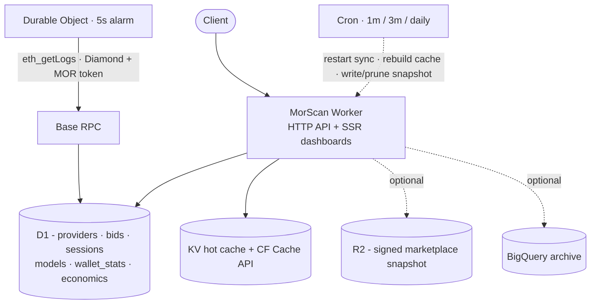

# Architecture

MorScan is one Cloudflare Worker that indexes the Morpheus contracts on Base L2,
stores state in D1, caches reads in KV / the CF Cache API, and renders
server-side dashboards. A Durable Object drives sync; cron triggers handle cache
rebuilds and the optional CDN snapshot.

## Source layout

| Path | What lives there |
|------|------------------|
| `src/index.ts` | Worker entry: `fetch()` router wiring + `scheduled()` cron multiplexer. |
| `src/routes/` | Route tables - `public.ts`, `auth.ts`, `api.ts`, `sync.ts`, `ui.ts`. |
| `src/handlers/` | Endpoint handlers (one concern per file) + `handlers/ui/` for SSR pages. |
| `src/providers/` | The open-core seam: commerce / analytics / admin provider interfaces + bundled reference impls. One injection point (`providers/index.ts`). |
| `src/sync/` | The indexer: compute + builder discovery, event processing, RPC, ABI parsers. |
| `src/durable/SyncCoordinator.ts` | Durable Object running the 5-second forward-only projector. |
| `src/utils/` | Cross-cutting helpers - `auth/`, `cache.ts`, `rpc.ts`, `bigquery/`, `provenance*.ts`, `snapshot*.ts`, `jwt.ts`. |
| `src/ui/` | HTML / Mustache templates for the dashboards. |
| `src/types.ts` | `Env` bindings, event signatures, shared types. |
| `seed/` | Optional historical session seed, indexes, and the BigQuery DDL. |

## Subsystem docs

### Indexing / sync
- [`architecture/sync.md`](architecture/sync.md) - the sync model end to end, including RPC failover and bounds checks.
- [`architecture/contracts.md`](architecture/contracts.md) - the Morpheus Diamond (EIP-2535): addresses, selectors, events, DiamondCut monitoring, and where the ABIs come from / how to update after an upgrade.
- [`architecture/builder-plane.md`](architecture/builder-plane.md) - the builder-staking (BuildersV4) plane.

### Data and accounting
- [`architecture/data-tier.md`](architecture/data-tier.md) - D1 source of truth, KV/CF cache layers, write dedup, incremental stat rebuilds, optional BQ.
- [`architecture/database.md`](architecture/database.md) - table reference.
- [`architecture/canonical-accounting.md`](architecture/canonical-accounting.md) - the session state machine and four-bucket wallet invariant.
- [`architecture/marketplace-snapshot.md`](architecture/marketplace-snapshot.md) - **(optional)** the signed CDN snapshot.
- [`architecture/bigquery-dual-write.md`](architecture/bigquery-dual-write.md) - **(optional)** the BigQuery dual-write / archive.

### Open-core seam
- [`architecture/providers.md`](architecture/providers.md) - the three provider interfaces (commerce, analytics, admin), their bundled reference impls, the single injection point, and the Sentry/Grafana + FSL framing.

### API, UI, security
- [`architecture/api.md`](architecture/api.md) - the `/mor/v1/*` API reference.
- [`architecture/ui.md`](architecture/ui.md) - the dashboard routes and templates.
- [`architecture/rate-limiting.md`](architecture/rate-limiting.md) - the metering model plus the burst + volume rate limiter.
- [`architecture/security.md`](architecture/security.md) - auth model, input/output hardening.
- [`architecture/alerting.md`](architecture/alerting.md) - operational alerts: deduped stall/RPC detection, the `alerts` table plus `/admin/alerts`, and the optional Telegram/Slack/Discord/webhook fan-out.

### Provenance
- [`architecture/provenance.md`](architecture/provenance.md) - per-row receipts, Merkle chaining, service attestation, the `/.well-known/morscan-keys.json` key-discovery endpoint, and verification.

## Specs

[`specs/`](specs/) holds planned or partially-scoped extensions. When a spec
ships, it is rewritten as an architecture doc. See [`specs/README.md`](specs/README.md).

## Roadmap

[`roadmap/`](roadmap/) holds numbered, self-contained specs for planned work.
The engine takes contracts, events, and decoders as inputs rather than assuming
one deployment, so pointing MorScan at another Morpheus contract is meant to be a
spec, decoders, and dashboard cards rather than a rebuild. See
[`roadmap/README.md`](roadmap/README.md).

## Getting started

New here? Start with [`GETTING_STARTED.md`](GETTING_STARTED.md), then
[`architecture/deployment.md`](architecture/deployment.md).
