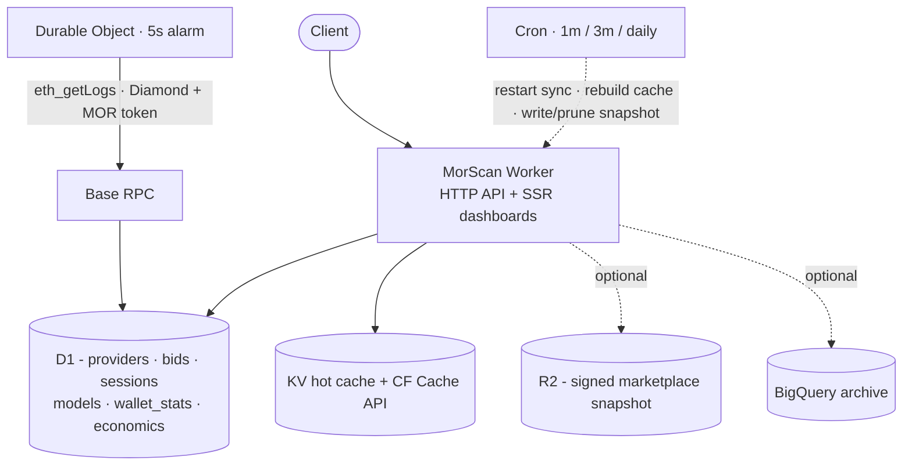

# Architecture

MorScan is one Cloudflare Worker that indexes the Morpheus contracts on Base L2,
stores state in D1, caches reads in KV / the CF Cache API, and renders
server-side dashboards. A Durable Object drives sync; cron triggers handle cache
rebuilds and the optional CDN snapshot.

## Source layout

| Path | What lives there |
|------|------------------|
| `src/index.ts` | Worker entry: `fetch()` router wiring + `scheduled()` cron multiplexer. |
| `src/routes/` | Route tables - `public.ts`, `auth.ts`, `api.ts`, `sync.ts`, `ui.ts`. |
| `src/handlers/` | Endpoint handlers (one concern per file) + `handlers/ui/` for SSR pages. |
| `src/providers/` | The open-core seam: commerce / analytics / admin provider interfaces + bundled reference impls. One injection point (`providers/index.ts`). |
| `src/sync/` | The indexer: compute + builder discovery, event processing, RPC, ABI parsers. |
| `src/durable/SyncCoordinator.ts` | Durable Object running the 5-second forward-only projector. |
| `src/utils/` | Cross-cutting helpers - `auth/`, `cache.ts`, `rpc.ts`, `bigquery/`, `provenance*.ts`, `snapshot*.ts`, `jwt.ts`. |
| `src/ui/` | HTML / Mustache templates for the dashboards. |
| `src/types.ts` | `Env` bindings, event signatures, shared types. |
| `seed/` | Optional historical session seed, indexes, and the BigQuery DDL. |

## Subsystem docs

### Indexing / sync
- [`sync.md`](sync.md) - the sync model end to end, including RPC failover and bounds checks.
- [`contracts.md`](contracts.md) - the Morpheus Diamond (EIP-2535): addresses, selectors, events, DiamondCut monitoring, and where the ABIs come from / how to update after an upgrade.
- [`builder-plane.md`](builder-plane.md) - the builder-staking (BuildersV4) plane.
- [`data-coverage.md`](data-coverage.md) - coverage floors per dataset, the separate-pass backfill, and how the syncing state is shown.

### Data and accounting
- [`data-tier.md`](data-tier.md) - D1 source of truth, KV/CF cache layers, write dedup, incremental stat rebuilds, optional BQ.
- [`database.md`](database.md) - table reference.
- [`canonical-accounting.md`](canonical-accounting.md) - the session state machine and four-bucket wallet invariant.
- [`marketplace-snapshot.md`](marketplace-snapshot.md) - **(optional)** the signed CDN snapshot.
- [`bigquery-dual-write.md`](bigquery-dual-write.md) - **(optional)** the BigQuery dual-write / archive.

### Open-core seam
- [`providers.md`](providers.md) - the three provider interfaces (commerce, analytics, admin), their bundled reference impls, the single injection point, and the Sentry/Grafana + FSL framing.

### API, UI, security
- [`api.md`](api.md) - the `/mor/v1/*` API reference.
- [`ui.md`](ui.md) - the dashboard routes and templates.
- [`rate-limiting.md`](rate-limiting.md) - the metering model plus the burst + volume rate limiter.
- [`security.md`](security.md) - auth model, input/output hardening.
- [`alerting.md`](alerting.md) - operational alerts: deduped stall/RPC detection, the `alerts` table plus `/admin/alerts`, and the optional Telegram/Slack/Discord/webhook fan-out.

### Contributing
- [`../../AGENTS.md`](../../AGENTS.md) - the repo as built: layout, gates, conventions.

### Provenance
- [`provenance.md`](provenance.md) - per-row receipts, Merkle chaining, service attestation, the `/.well-known/morscan-keys.json` key-discovery endpoint, and verification.

## Getting started

New here? Start with [`../product/getting-started.md`](../product/getting-started.md), then
[`deployment.md`](deployment.md).
