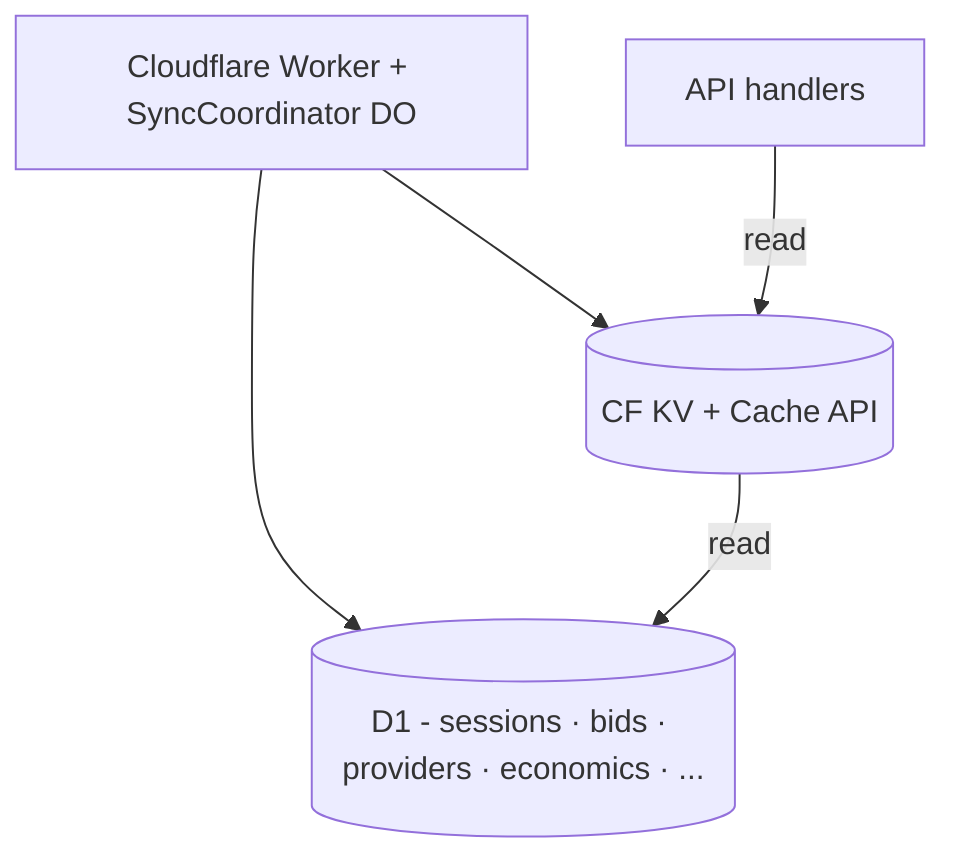

# MorScan Data Tier - as-built

D1 is the transactional source of truth. KV and the CF Cache API sit in front of
it to absorb repeat reads; an optional BigQuery dual-write archives every sync
write for downstream analytics.

## Big picture

D1 is the source of truth. KV + Cache API absorb repeat reads. The optional
BigQuery dual-write (off by default) is a side path; see
[`bigquery-dual-write.md`](bigquery-dual-write.md).

## Cache layer (load-bearing)

Two-tier cache in front of D1. Source: `src/utils/cache.ts` (`withKvCache`,
`withCfCache`, `warmKvCache`).

| Endpoint | Layer | TTL | Cache key | Notes |
|---|---|---|---|---|
| `/mor/v1/all` | KV | 30s | `v1:all` | Warm-written by SyncCoordinator after each compute tick. TTL matches client poll cadence. |
| `/mor/v1/providers` | KV | 30s | `v1:providers` | |
| `/mor/v1/providers/:addr` | CF Cache API | 5m | `v1:providers:<addr>` | Per-address. Kills the 8-query fan-out. |
| `/mor/v1/bids` | KV | 30s | `v1:bids` | |
| `/mor/v1/leaderboard` | KV | 10m | `v1:leaderboard:` | |
| `/mor/v1/models/demand` | KV | 10m | `v1:models:demand` | |
| `/mor/v1/reputation` | CF Cache API | 60s | `v1:reputation` | |
| `/mor/v1/holders` | CF Cache API | 5m | `v1:holders:<page>` | Per page. |
| `/mor/v1/sessions/daily` | KV | 10m | `v1:sessions:daily` | |
| `/health` | CF Cache API | 3s | `health:v1` | Eliminates a 6x COUNT + 4x first() D1 fan-out on every probe. |

KV freshness is checked against an embedded `cachedAt` timestamp to support
sub-60s effective TTLs under KV's 60s `expirationTtl` floor. Every cached
response carries `X-Cache: HIT|MISS`; HITs also set `X-Cache-Source: kv|cf`.

## Fatboy blob

The SPA is powered by one precomputed JSON blob ("fatboy"), rebuilt by
`buildFatboy()` in `src/handlers/fatboy.ts` on every cron tick. The build runs
20+ parallel D1 queries and stores the result in the D1 `sync_state` table as
`fatboy_cache`. The UI fetches it once at init via `GET /mor/v1/ui-init`, so
dashboard page loads put zero per-request query pressure on D1. See
[`ui.md`](ui.md) for how the SPA consumes it.

## Write dedup

| Path | Strategy |
|---|---|
| `captureTelemetry` on every `/mor/v1/*` | KV `tele:seen:<signer>` with 60s TTL. First hit in the window UPSERTs the node row; rest no-op. `first_seen`/`last_seen` are accurate at 60s resolution; `request_count` undercounts by design (kill the per-request D1 write, keep the visibility signal). |

Source: `src/handlers/telemetry.ts`.

## Optional BigQuery archive

The BQ dual-write client and admin endpoints ship in the Worker but are gated
behind `BIGQUERY_ENABLED="true"` + a service-account secret - **off by
default**. When enabled, every sync write is mirrored fire-and-forget to BQ; a
BQ outage never breaks D1 sync.

- `src/utils/bigquery/` - RS256 JWT auth, `insertRows`, `writeBqSafe`, row
  builders, backfill helpers.
- `src/handlers/bq.ts` - `/mor/v1/bq/status` and `/mor/v1/bq/backfill`.
- `seed/bq-schema.sql` - BigQuery DDL for the archived tables.
- Hook sites in `src/sync/` - event batches call `writeBqSafe`.

Full operating guide: [`bigquery-dual-write.md`](bigquery-dual-write.md).

## Stat rebuild strategy (incremental)

Both precomputed stat tables (`provider_stats`, `wallet_stats`) are rebuilt
**incrementally** by the sync projector, so wallet/provider analytics read
instantly with no `GROUP BY` over 97k+ session rows per request. On every tick
that processes SessionOpened / SessionClosed / BidPosted events,
`refreshWalletStats()` and `refreshProviderStats()` run for the affected wallets
and `(provider, model_id)` pairs only. Implementation:
`src/sync/compute-stats.ts`, driven from `src/sync/compute.ts`.

**Two functions (each stat table):**

- **Incremental - `refreshWalletStats(env, wallets: string[])`** (`wallets`
  required). For each wallet, one scoped `INSERT OR REPLACE INTO wallet_stats …
  SELECT … FROM sessions WHERE user_address = ? GROUP BY user_address` (one
  statement per wallet, not a single batch). Everyone else is untouched, so
  there is no empty-table window. `refreshProviderStats()` is the same shape for
  `(provider, model_id)` pairs.
- **Full rebuild - `rebuildAllWalletStats(env)`** (no wallet list): `DELETE FROM
  wallet_stats`, then rebuild every row from `sessions`.

**How affected wallets are tracked**, per tick in `sync()`
(`src/sync/compute.ts`):

1. `affectedWallets = new Set<string>()`.
2. **SessionOpened** adds the session's user (`src/sync/compute-events.ts`).
3. **SessionClosed** looks up `user_address` from the D1 `sessions` row by
   session id.

**Which path runs** after processing each tick:

- If `wallet_stats` is **empty** (fresh schema), call `rebuildAllWalletStats()`
  once.
- Else if `affectedWallets.size > 0`, call `refreshWalletStats(env,
  [...affectedWallets])`.
- Otherwise, do nothing.

There is no full-rebuild cron and no `full_sync_running` mutex; the full rebuild
is purely the empty-table bootstrap and an admin-triage fallback, not a per-tick
sync path. Row shapes, column formulas, and every downstream read response are
unchanged. A normal tick updates 1-3 wallets instead of rebuilding the whole
table, so D1 write volume is proportional to activity, not table size.

## Doctrine

- **D1 is the transactional source of truth.**
- **Every cache layer is best-effort and idempotent** - a KV or CF Cache miss
  falls through to D1, never errors.
- **Purely observational writes** (like telemetry node heartbeats) should not hit
  D1 per request; dedup in KV and flush at a useful resolution.
- **Stats tables rebuild incrementally, per affected entity.**
